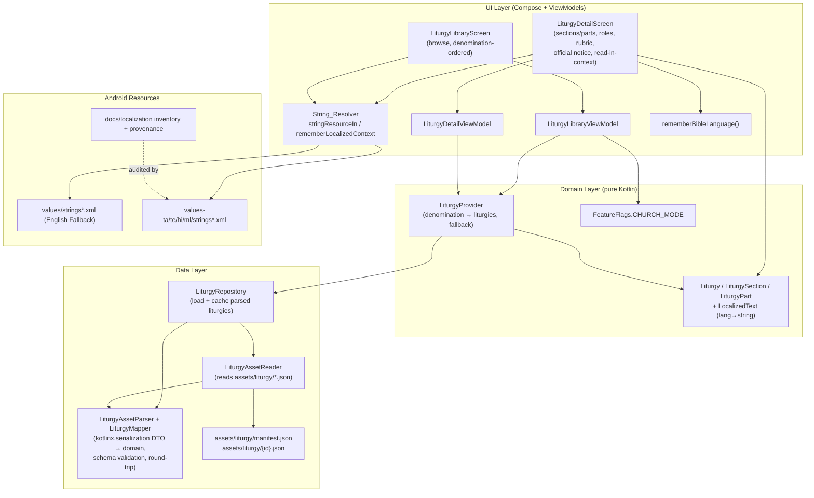

# Design Document

## Overview

This design delivers two coupled, production-grade improvements to **Manna** (`com.manna.bible`):

1. **Bible-language localization (gap fill)** — Manna's chrome is English-only in practice since BASE-08 removed the in-app UI-language switch, while scripture and recited prayer text follow the user's **Bible Language** (`SetupState.bibleLanguage` ∈ {`en`, `ta`, `te`, `hi`, `ml`}). PR #80 shipped six Gemini features whose strings live only in default `values/`. This work routes those (and other gap) surfaces through the existing `stringResourceIn(languageTag, …)` mechanism in `ui/util/LocalizedString.kt`, ships `ta/te/hi/ml` translations for the AI feature strings, and adds a **verifiable translation inventory + automated check** (placeholder-token preservation, provenance / pending-review tracking) so "everything shows in the Bible language" is auditable.

2. **Mass / Liturgy Guide (new feature)** — The current Church Mode shows one hardcoded English liturgy chosen from two Kotlin constants in `domain/liturgy/DefaultLiturgyProvider.kt`, via a tradition switcher. This work evolves it into a production **Liturgy Library**: a browsable, denomination-ordered list (`Liturgy_Library`) of fully-offline, **bundled JSON** liturgies and a detail surface (`Liturgy_Detail`) that expands a selected order into its sections and parts in celebrated sequence — role-distinguished, rubric-aware, official-text-aware, scripture-linked, multilingual (Bible language with English fallback), and accessible.

The concerns are coupled: `Liturgy_Detail` renders its **static framing strings** (role labels, official-text notice, "read in context", source-note label) through the same `String_Resolver` defined by Concern 1, while **liturgy content** (titles, spoken text, rubrics) is resolved from the bundled asset's per-language fields with an English fallback.

### Design Principles Carried Forward

- **Never invent liturgy** (CLAUDE.md content policy): ship structure, rubrics, authentic short responses, and public-domain / traditional / ICET ordinary texts; presidential prayers proper to the day stay as **Official-Text Parts** that point to the parish Missal — never fabricated, and never auto-translated by the AI engine.
- **Offline-first**: liturgy content is bundled under `app/src/main/assets/`, loaded with **no network request**, mirroring `assets/bibles/manifest.json` + `assets/canon/*.json`.
- **Dual language**: framing strings follow the Bible Language via Android resources; sacred content follows the Bible Language via authored asset fields, falling back to English.
- **Accessibility**: `sp` text, ≥48dp targets (≥56dp in Simplified Mode), content descriptions, RTL mirroring.
- **Feature-flag gating**: the library stays behind `FeatureFlags.CHURCH_MODE`.

### Requirements Coverage Map

| Area | Requirements |
|------|--------------|
| AI string resolution + `ta/te/hi/ml` coverage | 1.1–1.5 |
| `String_Resolver` mechanism + bundle config | 2.1–2.5 |
| Inventory + automated gap check | 3.1–3.4 |
| Translation provenance + placeholder check | 4.1–4.5 |
| Browse list | 5.1–5.5 |
| Select / expand order | 6.1–6.7 |
| Roles / rubrics / official-text / scripture link | 7.1–7.5 |
| Content in Bible language + framing fallback | 8.1–8.5 |
| Offline bundled content | 9.1–9.4 |
| Asset parsing + integrity + round-trip | 10.1–10.5 |
| Denomination → liturgy mapping | 11.1–11.6 |
| Content policy / source note | 12.1–12.5 |
| Feature-flag gating | 13.1–13.4 |
| Accessibility | 14.1–14.5 |

---

## Architecture

Both concerns slot into the existing Clean Architecture (UI → Domain → Data) and the existing Hilt graph (`di/AppModule.kt`, `di/BindingsModule.kt`). The Liturgy Library replaces the hardcoded `DefaultLiturgyProvider` with an **asset-backed** provider built on a data-layer reader/parser that mirrors the canon and bundled-bible patterns.



### Component Responsibilities

**Concern 1 — Localization**
- **`String_Resolver`** (`ui/util/LocalizedString.kt`, existing): resolves a string / string-array in a supplied BCP-47 tag via a config-overridden `Context`, blank → UI locale, missing → English fallback. Reused as-is (Req 2.1–2.3); the AI surfaces are migrated to call it.
- **`rememberBibleLanguage()`** (`ui/util/BibleLanguage.kt`, existing): supplies the live Bible Language tag to Compose; recomposes on preference change (Req 2.4).
- **Locale resources** (`values-ta/te/hi/ml`): gain the AI feature strings (Req 1.3, 3.2).
- **Localization inventory + automated check** (new, test-side): a JVM unit test that diffs `values/` against each locale and validates placeholder tokens + provenance (Req 3.1–3.4, 4.x).

**Concern 2 — Liturgy**
- **`LiturgyProvider`** (domain interface, existing — extended): denomination→liturgy mapping with fallback, "all" listing.
- **`AssetLiturgyProvider`** (new, replaces `DefaultLiturgyProvider` binding): pulls parsed liturgies from `LiturgyRepository`, applies mapping/fallback (Req 11.x).
- **`LiturgyRepository`** (new, data): loads via reader+parser once, caches in memory, exposes the valid liturgies; drops invalid assets (Req 10.2).
- **`LiturgyAssetReader`** (new, data): reads `assets/liturgy/manifest.json` and only the manifest-listed `{id}.json` files (Req 9.x, 10.4).
- **`LiturgyAssetParser` / `LiturgyMapper`** (new, data): kotlinx.serialization DTO ↔ domain mapping, schema validation, round-trip (Req 10.1, 10.3, 10.5).
- **`LiturgyLibraryScreen` / `LiturgyDetailScreen`** (UI): browse + detail, replacing the single `ChurchModeScreen` switcher (Req 5–8, 14).

---

## Components and Interfaces

### Concern 1 — Localization

#### String resolution (reused, unchanged)
The existing helpers already satisfy Req 2.1–2.3 and the fallback behavior of Req 1.4/1.5 — Android resource resolution returns the locale value when present and the default `values/` value otherwise:

```kotlin
@Composable fun rememberLocalizedContext(languageTag: String): Context   // blank → UI locale
@Composable fun stringResourceIn(languageTag: String, @StringRes id: Int): String
@Composable fun stringArrayResourceIn(languageTag: String, @ArrayRes id: Int): Array<String>
```

#### AI feature surface migration (Req 1.2)
Each of the six PR #80 surfaces (Crisis AI, Sermon Builder, Verse Cards, Persecution Comfort, Cultural Lens, Oral AI) must resolve its static strings through `stringResourceIn(bibleLanguage, …)` instead of `stringResource(…)`. Pattern (already used by `ParalokaScreen`):

```kotlin
val bibleLanguage = rememberBibleLanguage()
Text(stringResourceIn(bibleLanguage, R.string.crisis_heading))
```

A lightweight lint-style guard (see Testing Strategy) asserts these surfaces contain no raw `stringResource(` calls for user-facing static text, keeping Req 1.2 enforceable over time.

#### Translation inventory + provenance (Req 3, 4)
Because Android resource XML cannot itself carry provenance, we add a **machine-readable provenance manifest** checked into the repo and consumed only by tests/tooling (never shipped logic):

- **Location:** `app/src/test/resources/localization/translation-provenance.json`
- **Schema:**

```json
{
  "locales": {
    "ta": {
      "provenance": "human-reviewed | community | machine-pending-review",
      "reviewed": ["crisis_title", "crisis_heading"],
      "deferred": { "cultural_lens_long_disclaimer": "awaiting native-speaker review" }
    },
    "te": { "...": "..." },
    "hi": { "...": "..." },
    "ml": { "...": "..." }
  }
}
```

The **automated check** (a JUnit 5 test, see Testing Strategy) does the following:
1. Parses `values/strings*.xml` to build the set of user-facing string keys (Req 3.1).
2. For each locale, reports any default key absent from that locale **and** not listed under `deferred` (Req 3.3). Deferred items require a reason string (Req 3.2).
3. For every translated value, extracts placeholder tokens (`%1$s`, `%d`, `%%`, `\n`, `\'`, `\"`, `&amp;` etc.) from the English Fallback and the translation; if the **multiset of tokens differs** AND the key is **not** in that locale's `reviewed` list, the value is flagged invalid (Req 4.3, 4.4). Keys in `reviewed` are accepted without placeholder flagging (Req 4.5).
4. Records per-locale `provenance` (Req 4.1) and treats any non-`human-reviewed` value as pending review (Req 4.2).

This keeps `MissingTranslation` lint disabled for incremental batches (Req 3.4) while the inventory test provides the completeness + quality guarantee.

### Concern 2 — Liturgy

#### Domain (extended)
The existing `LiturgyProvider` interface is extended to express denomination mapping with a totality/fallback guarantee:

```kotlin
interface LiturgyProvider {
    fun all(): List<Liturgy>                                  // Req 5.1, 11.5
    fun forDenomination(denomination: Denomination): List<Liturgy>  // mapped first, Req 11.1
    fun defaultFor(denomination: Denomination): Liturgy?      // existing; Req 11.2/11.4
    fun resolvedDefaultFor(denomination: Denomination): Liturgy?    // never null when any liturgy exists, Req 11.3/11.6
}
```

`resolvedDefaultFor` returns `defaultFor(d) ?: all().firstOrNull()` so a denomination with no explicit mapping still yields a selectable order whenever the library is non-empty (Req 11.3, 11.6).

#### `AssetLiturgyProvider` (new)
Replaces `DefaultLiturgyProvider` in the Hilt binding (`BindingsModule.bindLiturgyProvider`). It holds the parsed, validated liturgies (from `LiturgyRepository`) and a static denomination→liturgy-id mapping table:

```kotlin
private val MAPPING: Map<Denomination, List<String>> = mapOf(
    Denomination.CATHOLIC          to listOf("roman_catholic_mass"),     // Req 11.2
    Denomination.CSI               to listOf("csi_holy_communion"),      // Req 11.4
    Denomination.PROTESTANT_OTHER  to listOf("csi_holy_communion"),      // Req 11.4
    Denomination.ORTHODOX          to listOf("orthodox_holy_qurbana"),   // future asset
    Denomination.MAR_THOMA         to listOf("mar_thoma_holy_qurbana"),  // future asset
    Denomination.SHOW_EVERYTHING   to emptyList()                        // → all(), Req 11.5
)
```

`forDenomination` returns mapped-and-available liturgies first, then the remainder (Req 5.3, 11.1); `SHOW_EVERYTHING` returns `all()` (Req 11.5); when a mapped id is missing from the library it is skipped and fallback applies (Req 11.3).

#### `LiturgyRepository` (new, data)
```kotlin
@Singleton
class LiturgyRepository @Inject constructor(
    private val reader: LiturgyAssetReader
) {
    private val cached = AtomicReference<List<Liturgy>?>(null)
    suspend fun liturgies(): List<Liturgy>   // parse-once, cache; only valid entries (Req 10.2)
}
```

#### `LiturgyAssetReader` (new, data) — mirrors `BundledBibleAssetReader` / `AssetCanonDefinitionDataSource`
```kotlin
@Singleton
class LiturgyAssetReader @Inject constructor(
    @ApplicationContext private val context: Context,
    private val json: Json                       // the existing ignoreUnknownKeys/lenient instance
) {
    suspend fun manifest(): LiturgyManifest?     // assets/liturgy/manifest.json, null if absent
    suspend fun readAll(): List<LiturgyParseResult>  // only manifest-listed files (Req 10.4)
}
```
- All I/O + decode on `Dispatchers.IO`.
- Each manifest entry's `{id}.json` is read via `runCatching`; a failure yields a `LiturgyParseResult.Failure(id, message)` rather than throwing (Req 10.2), so one bad asset never removes the others or crashes.

#### `LiturgyAssetParser` / `LiturgyMapper` (new, data) — mirrors `CanonDefinitionMapper`
Pure JVM-testable parse+map from a raw JSON string (no `AssetManager`), plus the reverse for the round-trip property:

```kotlin
internal object LiturgyMapper {
    fun parse(json: Json, raw: String): Liturgy            // DTO → domain, validates (Req 10.1)
    fun serialize(json: Json, liturgy: Liturgy): String    // domain → DTO JSON (Req 10.3)
    fun validate(dto: LiturgyDto): List<String>            // schema/consistency errors (Req 10.5)
}
```

Validation rules (Req 10.5): non-blank `id`/`title`/`tradition`/`sourceNote`; every `LocalizedText` has an `en` value; declared `languages` ⊆ languages actually present across parts (and vice-versa for the consistency flag); each part role parses to a known `LiturgyRole`; `needsOfficialText` parts may omit content text.

#### UI: ViewModels
```kotlin
data class LiturgyLibraryUiState(
    val isLoading: Boolean = true,
    val entries: List<LiturgyListItem> = emptyList(),  // denomination-ordered (Req 5.2/5.3)
    val denominationHasMapping: Boolean = true         // drives "being prepared" note (Req 5.4)
)
data class LiturgyListItem(val id: String, val title: String, val tradition: String)

data class LiturgyDetailUiState(
    val isLoading: Boolean = true,
    val liturgy: Liturgy? = null,
    val bibleLanguage: String = "en"
)
```
`LiturgyLibraryViewModel` combines `preferencesStore.setupState` (denomination) with `provider.forDenomination(...)`; `LiturgyDetailViewModel` loads a liturgy by id and observes `setupState.bibleLanguage` (Req 8.5). Both consult no network (Req 9.3) and are populated entirely from bundled assets (Req 5.5, 9.2).

---

## Data Models

### Liturgy domain model (extended for multilingual content)

The current `LiturgyPart` carries plain `String?` text. To satisfy Req 8 (content in Bible language with English fallback) **without** auto-translating sacred text, each human-facing content field becomes a **`LocalizedText`** — a small value object mapping language tag → authored string, with English required and a deterministic fallback resolver.

```kotlin
/** Authored, multilingual sacred text. English ("en") is always present; other
 *  languages appear only where an authoritative published translation exists. */
data class LocalizedText(private val values: Map<String, String>) {
    val english: String get() = values.getValue("en")
    /** Bible-language value if authored, else the English fallback (Req 8.1/8.2). */
    fun resolve(languageTag: String): String = values[languageTag] ?: english
    val languages: Set<String> get() = values.keys
    init { require(values.containsKey("en")) { "LocalizedText must contain 'en'" } }
}

data class LiturgyPart(
    val role: LiturgyRole,
    val title: LocalizedText? = null,
    val text: LocalizedText? = null,
    val rubric: LocalizedText? = null,
    val osisRef: String? = null,
    val needsOfficialText: Boolean = false
)
data class LiturgySection(val title: LocalizedText, val parts: List<LiturgyPart>)
data class Liturgy(
    val id: String,
    val title: LocalizedText,
    val tradition: String,            // a label, not user-prose; kept simple
    val sections: List<LiturgySection>,
    val sourceNote: LocalizedText,    // Req 12.4/12.5
    val denominations: List<Denomination> = emptyList(),
    val languages: Set<String> = setOf("en")
)
```

`LiturgyRole` is unchanged (`PRESIDER, PEOPLE, ALL, READER, RUBRIC`). Migration note: the two existing Kotlin liturgies' current `String` values become the `"en"` entry of each `LocalizedText`, so **no source notes or content are lost** — they are transcribed verbatim into JSON assets (see Migration below).

### Bundled asset JSON schema

Mirrors the `assets/bibles/manifest.json` (index) + per-item-file convention and is parsed by the existing injected `Json` (ignoreUnknownKeys, lenient).

**`assets/liturgy/manifest.json`** (Req 9.4, 10.4):
```json
{
  "liturgies": [
    {
      "id": "roman_catholic_mass",
      "title": "The Holy Mass",
      "tradition": "Roman Catholic",
      "denominations": ["catholic"],
      "languages": ["en"],
      "assetFile": "roman_catholic_mass.json"
    },
    {
      "id": "csi_holy_communion",
      "title": "The Holy Communion",
      "tradition": "Church of South India",
      "denominations": ["csi", "protestant_other"],
      "languages": ["en"],
      "assetFile": "csi_holy_communion.json"
    }
  ]
}
```

**`assets/liturgy/{id}.json`** (one order of service):
```json
{
  "id": "roman_catholic_mass",
  "title": { "en": "The Holy Mass" },
  "tradition": "Roman Catholic",
  "denominations": ["catholic"],
  "languages": ["en"],
  "sourceNote": { "en": "Order of Mass, Roman Rite — structure per the USCCB Order of Mass. Ordinary texts in traditional / ecumenical (ICET) English. The prayers proper to the day (Collect, Preface, Eucharistic Prayer, Prayer after Communion) follow the parish Missal." },
  "sections": [
    {
      "title": { "en": "Introductory Rites" },
      "parts": [
        { "role": "RUBRIC", "rubric": { "en": "All stand. The Mass begins with an entrance hymn…" } },
        { "role": "PRESIDER", "title": { "en": "Sign of the Cross" }, "text": { "en": "In the name of the Father, and of the Son, and of the Holy Spirit." } },
        { "role": "PEOPLE", "text": { "en": "Amen." } },
        { "role": "RUBRIC", "title": { "en": "Collect" }, "rubric": { "en": "The Priest sings or says the Collect — the opening prayer proper to the day." }, "needsOfficialText": true }
      ]
    }
  ]
}
```

**Serialization DTOs** (data layer, `@Serializable`, mirroring `CanonDefinitionDto`):
```kotlin
@Serializable data class LiturgyManifestDto(val liturgies: List<LiturgyManifestEntryDto> = emptyList())
@Serializable data class LiturgyManifestEntryDto(
    val id: String, val title: String, val tradition: String,
    val denominations: List<String> = emptyList(),
    val languages: List<String> = listOf("en"),
    val assetFile: String
)
@Serializable data class LiturgyDto(
    val id: String, val title: Map<String, String>, val tradition: String,
    val denominations: List<String> = emptyList(),
    val languages: List<String> = listOf("en"),
    val sourceNote: Map<String, String>,
    val sections: List<LiturgySectionDto>
)
@Serializable data class LiturgySectionDto(val title: Map<String, String>, val parts: List<LiturgyPartDto>)
@Serializable data class LiturgyPartDto(
    val role: String,
    val title: Map<String, String>? = null,
    val text: Map<String, String>? = null,
    val rubric: Map<String, String>? = null,
    val osisRef: String? = null,
    val needsOfficialText: Boolean = false
)
```
`Map<String,String>` ↔ `LocalizedText`; unknown roles or missing `en` keys are validation failures (Req 10.1, 10.5).

### Migration of the two existing liturgies (Req 12 preserved)

The contents of `ROMAN_CATHOLIC_MASS` and `CSI_HOLY_COMMUNION` in `DefaultLiturgyProvider.kt` — including the `osisRef = "1CO.11.23"` Words of Institution, every `needsOfficialText` flag, and both verbatim `sourceNote`s — are transcribed into `roman_catholic_mass.json` and `csi_holy_communion.json` under the `"en"` key of each `LocalizedText`. A migration **fidelity test** parses both assets and asserts structural equality (section/part order, roles, official-text flags, osisRefs, source notes) against the legacy constants before `DefaultLiturgyProvider` is removed, guaranteeing the content policy and provenance survive the move. Vernacular (`ta/te/hi/ml`) content is added only where an authoritative published translation exists; otherwise parts resolve to the English ordinary text or remain Official-Text Parts (Assumptions 3–4; Req 8.2, 12.2).

### Denomination → liturgy mapping table

| Denomination | Default (Req 11.2/11.4) | Listing behavior |
|---|---|---|
| `CATHOLIC` | `roman_catholic_mass` | mapped first, then others (11.1/5.3) |
| `CSI` | `csi_holy_communion` | mapped first |
| `PROTESTANT_OTHER` | `csi_holy_communion` | mapped first |
| `ORTHODOX` | `orthodox_holy_qurbana`* | falls back to available until asset ships (11.3/11.6); "being prepared" note (5.4) |
| `MAR_THOMA` | `mar_thoma_holy_qurbana`* | falls back to available until asset ships (11.3/11.6) |
| `SHOW_EVERYTHING` | none | all entries selectable (11.5) |

\* Planned future assets under the same content policy (Assumption 1); absent in the first release, so fallback applies.

---

## UI Design

### Liturgy_Library (browse)
A `LazyColumn` list replacing the inline switcher. Each row is a card showing the liturgy **title** and **tradition** (Req 5.2), tradition labels in the Bible Language framing where applicable. The user's mapped entries render first under their own implicit grouping (Req 5.3). When the denomination has no mapping, a calm note ("an order for your tradition is being prepared") appears above the still-complete list (Req 5.4). The full list renders from bundled assets with no connectivity (Req 5.5, 9.2). Tapping a row navigates to `Liturgy_Detail` (new `Routes.LITURGY_DETAIL` carrying the liturgy id); back returns to the list (Req 6.7).

### Liturgy_Detail (expanded order of service)
Reuses and extends the proven `ChurchModeScreen` rendering:
- Sections rendered in authored order as headings (Req 6.1, 6.3); parts in authored order (Req 6.2).
- **Part titles** shown when present (Req 6.4); **spoken text** shown when present (Req 6.5), resolved via `text.resolve(bibleLanguage)` (Req 8.1) with English fallback (Req 8.2).
- **Role labels** for `PRESIDER/PEOPLE/ALL/READER` via `stringResourceIn(bibleLanguage, R.string.church_role_*)`, color-differentiated using the existing `roleColor()` mapping (Req 7.1, 7.3).
- **Rubrics** (`RUBRIC`) render as muted italic stage-directions with **no speaker role label**, even when the rubric text itself says "The priest says…" (Req 7.2).
- **Official-Text Parts** show the `church_needs_official` notice and never reproduce fabricated text (Req 7.4, 12.2); if an authorized official text is authored it may be shown alongside (Req 12.3).
- **Scripture link**: parts with `osisRef` expose a "read in context" action that calls the existing `onOpenVerse(osisRef)` pathway (Req 7.5, Assumption 6).
- **Source note** rendered at the foot via `sourceNote.resolve(bibleLanguage)` (Req 12.5).
- **Framing strings** (role labels, official notice, read-in-context, source label) always resolve through the `String_Resolver` in the Bible Language, even while content is on English fallback (Req 8.3, 8.4).
- Changing the Bible Language re-resolves subsequently opened liturgies (Req 8.5) because `rememberBibleLanguage()` recomposes.

### Accessibility (Req 14)
- All text uses `sp`/Material typography (scales with system font) (Req 14.1).
- Interactive rows/buttons ≥48dp; ≥56dp when `simplifiedMode` is active, read from `PreferencesStore.simplifiedMode` (Req 14.2, 14.3).
- Content descriptions on the back control, scripture-link affordance, and meaningful icons (Req 14.4).
- When the Bible Language is an RTL script, the whole layout mirrors via `LocalLayoutDirection`, independent of individual content language (Req 14.5).

### Feature-flag gating (Req 13)
The `More → Pray` entry (`onOpenChurch`) and the `Routes.LITURGY_*` composables remain wrapped in `if (FeatureFlags.CHURCH_MODE)`, exactly as the existing Church Mode wiring in `MannaApp.kt` — hidden entry point when false (13.1), exposed when true (13.3), gated through `FeatureFlags` per convention (13.4). Cached/parsed data may persist internally while the entry is hidden (13.2).


---

## Correctness Properties

*A property is a characteristic or behavior that should hold true across all valid executions of a system — essentially, a formal statement about what the system should do. Properties serve as the bridge between human-readable specifications and machine-verifiable correctness guarantees.*

The following properties were derived from the acceptance-criteria prework and de-duplicated so each provides unique validation value. Properties exercising pure domain logic (the `LocalizedText` resolver, `LiturgyProvider` mapping, `LiturgyMapper` parse/serialize, role mappings) run on the JVM with kotlinx fuzz-style generated inputs; UI-rendering properties run under Robolectric/Compose with generated liturgies.

### Property 1: Liturgy serialization round-trip

*For any* valid `Liturgy`, serializing it to the asset JSON format and parsing the result SHALL produce an equivalent `Liturgy` (same id, title, tradition, source note, denominations, languages, and the same sections and parts — including role, localized title/text/rubric, `osisRef`, and `needsOfficialText` — in the same order).

**Validates: Requirements 10.3**

### Property 2: Parse preserves authored order

*For any* valid liturgy asset, parsing it SHALL yield its sections in authored order and, within each section, its parts in authored order.

**Validates: Requirements 6.1, 6.2, 10.1**

### Property 3: Malformed assets fail safely

*For any* input that is malformed JSON or fails schema validation, the parser/reader SHALL return a descriptive failure result and SHALL NOT throw, and the resulting `Liturgy_Library` SHALL exclude that entry while retaining all valid entries.

**Validates: Requirements 10.2**

### Property 4: Manifest-only loading

*For any* `Liturgy_Manifest`, the set of asset files the reader opens SHALL be a subset of the `assetFile` values listed in that manifest (no unlisted file is loaded).

**Validates: Requirements 9.3, 10.4**

### Property 5: Manifest completeness

*For any* bundled liturgy referenced by the library, its manifest entry SHALL carry a non-blank id, title, tradition, at least one mapped denomination set (possibly empty list is allowed only for show-everything content), and a non-empty `languages` list including `en`.

**Validates: Requirements 9.4**

### Property 6: Language/content consistency

*For any* liturgy asset, validation SHALL flag it as inconsistent if and only if the set of languages it declares differs from the set of languages actually present across its parts' localized fields.

**Validates: Requirements 10.5**

### Property 7: LocalizedText fallback determinism

*For any* `LocalizedText` and any requested language tag, `resolve(tag)` SHALL return the authored value for that tag when present, and the English value otherwise; English is always present.

**Validates: Requirements 1.4, 8.1, 8.2**

### Property 8: Source note present and rendered

*For any* valid `Liturgy`, its resolved source note SHALL be non-blank and SHALL appear on the rendered `Liturgy_Detail`.

**Validates: Requirements 12.4, 12.5**

### Property 9: Rendered surfaces contain resolved content

*For any* `Liturgy` rendered in `Liturgy_Detail`, every section heading SHALL contain that section's resolved title, every part with a title SHALL display its resolved title, and every part with spoken text SHALL display its resolved text; and *for any* listed entry in `Liturgy_Library`, the row SHALL contain its title and tradition.

**Validates: Requirements 5.2, 6.3, 6.4, 6.5**

### Property 10: Role-label totality

*For any* `Liturgy_Part`, the part SHALL be assigned a speaker role label exactly when its role is one of `PRESIDER`, `PEOPLE`, `ALL`, or `READER`; a `RUBRIC` part SHALL receive no speaker role label and SHALL be styled as an instruction, regardless of any role-referencing phrasing in its text.

**Validates: Requirements 7.1, 7.2**

### Property 11: Speaking roles are visually distinct

*For any* two distinct roles drawn from `PRESIDER`, `PEOPLE`, `ALL`, `READER`, the color assigned by the role-color mapping SHALL be defined for each and SHALL differ between them.

**Validates: Requirements 7.3**

### Property 12: Official-Text Parts show the notice and never fabricate

*For any* `Liturgy_Part` with `needsOfficialText = true`, `Liturgy_Detail` SHALL display the official-text notice directing the user to the parish book, and SHALL NOT present a fabricated proper-prayer body as authoritative text.

**Validates: Requirements 7.4, 12.2**

### Property 13: Scripture references are openable

*For any* `Liturgy_Part` with a non-null `osisRef`, `Liturgy_Detail` SHALL expose an action that, when invoked, calls `onOpenVerse` with exactly that `osisRef`.

**Validates: Requirements 7.5**

### Property 14: Denomination mapping ordering and completeness

*For any* `Denomination` and any bundled library, `forDenomination` SHALL return, as a prefix, exactly the liturgies mapped to that denomination that are available, followed by the remaining available liturgies, and the returned set SHALL equal the full set of available liturgies (for `SHOW_EVERYTHING`, the entire library is selectable).

**Validates: Requirements 5.1, 5.3, 11.1, 11.5**

### Property 15: Default resolution is total with fallback

*For any* `Denomination`, whenever the library contains at least one valid liturgy, `resolvedDefaultFor` SHALL return a non-null selectable liturgy (falling back to an available entry when the mapped default is absent), while the full listing still exposes every available liturgy.

**Validates: Requirements 11.3, 11.6**

### Property 16: Translation placeholder preservation with review override

*For any* translated value of an AI Feature String, the automated check SHALL accept it without a placeholder flag exactly when either its placeholder/format-token multiset equals that of the English Fallback, or the value is marked human-reviewed; otherwise (tokens differ and not reviewed) the check SHALL flag it invalid.

**Validates: Requirements 4.3, 4.4, 4.5**

### Property 17: Localization gap-check correctness

*For any* user-facing string key and any target locale, the automated check SHALL flag the key as a gap if and only if the key exists in the default `values/` resources, has no value in that locale, and is not recorded as a deferred item for that locale.

**Validates: Requirements 3.3**

### Property 18: Blank-tag resolution follows the UI locale

*For any* string resource, resolving it with a blank language tag SHALL produce the same value as resolving it against the UI locale (the resolver returns the base context unchanged for a blank tag).

**Validates: Requirements 2.3**

---

## Error Handling

| Condition | Handling | Requirement |
|---|---|---|
| `assets/liturgy/manifest.json` missing | `LiturgyAssetReader.manifest()` catches `FileNotFoundException`/`IOException` and returns `null`; `LiturgyRepository` yields an empty library; `Liturgy_Library` shows the empty/prepared state without crashing | 9.x, 10.2 |
| A manifest-listed `{id}.json` missing or unreadable | Per-file `runCatching` → `LiturgyParseResult.Failure(id, message)`; entry excluded, others retained | 10.2 |
| Malformed JSON / schema violation (missing `en`, unknown role, blank id) | `LiturgyMapper.parse` throws internally; caught and converted to a `Failure` with a descriptive message; entry excluded | 10.1, 10.2 |
| Declared languages ≠ languages present in parts | `LiturgyMapper.validate` returns a non-empty error list; entry flagged inconsistent and excluded; surfaced to the inventory/CI check | 10.5 |
| Mapped default liturgy id absent from library | `resolvedDefaultFor` falls back to `all().firstOrNull()`; library still lists everything | 11.3, 11.6 |
| Denomination with no mapping | `Liturgy_Library` shows the "being prepared" note and the complete list | 5.4 |
| Bible-language content absent for a part | `LocalizedText.resolve` returns the English value; framing strings still resolve in the Bible Language | 8.2, 8.3 |
| Missing translation for a framing/AI string | Android resource resolution returns the default `values/` value (English Fallback) | 1.4, 1.5 |
| No network at any point | No network collaborator exists on the reader; all liturgy loading is from `AssetManager` | 9.2, 9.3 |
| `FeatureFlags.CHURCH_MODE = false` | Entry point and routes are not registered; no user-facing exposure | 13.1 |

All asset I/O and JSON decoding occur on `Dispatchers.IO`, consistent with `BundledBibleAssetReader` and `AssetCanonDefinitionDataSource`.

---

## Testing Strategy

Frameworks (per CLAUDE.md / build config): **JUnit 5 (Jupiter)**, **MockK**, **Turbine** for Flow, Robolectric/Compose UI test for rendering and resource resolution. Property-based testing is appropriate here because the parser, the `LocalizedText` resolver, the denomination mapping, and the translation checks are pure functions with universal invariants over large input spaces.

### Hang-safety (CI reliability)

The unit-test build MUST never hang indefinitely. Two guards enforce this:
- **Hard task timeout:** `app/build.gradle.kts` configures a ceiling on the test task itself, e.g. `tasks.withType<Test>().configureEach { timeout.set(Duration.ofMinutes(20)) }`. If anything stalls, Gradle fails the task with a diagnostic instead of blocking CI indefinitely.
- **Per-test timeout on rendering tests:** every Compose/Robolectric rendering test carries a per-method timeout (JUnit 5 `@Timeout`, e.g. 60s per test method) so a stuck render fails fast rather than wedging the run. This directly addresses the observed failure mode where `runComposeUiTest`/`waitForIdle` waits on an idle/frame signal that never arrives in a headless CI runner, leaving the Gradle task hanging with no per-test bound.

### Verification level for rendering properties

Prefer verifying a correctness property **without** a full Compose render whenever the property's logic can be exercised at a lower level; reserve Robolectric/Compose for properties that genuinely require rendered output.
- **Pure-logic facets (verified on the JVM, ≥100 iterations):** properties whose logic is pure decision-making are verified by extracting the decision into a pure, JVM-testable function and property-testing **that** function, with the composable simply consuming the same function:
  - **Property 10** (role-label totality / rubric-has-no-speaker-label) → a pure role-label mapping (e.g. a `liturgyPartView(...)` / role-label function).
  - **Property 12** (official-text notice presence & no fabrication) → a pure `shouldShowOfficialNotice(...)` decision.
  - **Property 13** (scripture openable / `onOpenVerse` wiring) → a pure mapping from a part's `osisRef` to the open action.
  - **Property 8** (source-note non-blank) → the pure resolved-source-note value.
- **Render-required facets (Robolectric/Compose, 20 iterations, `@Timeout`):** only properties that assert the resolved output actually appears in the UI remain Compose tests — **Property 9** (resolved text shown in `Liturgy_Detail` and the `Liturgy_Library` rows) and **Property 18** (blank-tag resolution follows the UI locale, which exercises Android resource resolution). These run at **20 iterations**, MUST carry a per-test `@Timeout`, and MUST be configured to run reliably under Robolectric (correct `@Config` / `@GraphicsMode`, bounded waits — never an unbounded `waitForIdle`). If such a test cannot be made reliably non-hanging in CI, it is acceptable to move it to the instrumented `androidTest` source set (documented) so the JVM unit-test suite stays fast and hang-free, with the pure-logic facet still covered at ≥100 iterations on the JVM.

### Property-based tests
- **Library:** use **`io.kotest.property`** (Kotest property testing) — a mature Kotlin PBT library; do not hand-roll generators. Add it as a `testImplementation` dependency. If the team prefers to avoid a new dependency, jqwik (JUnit 5-native) is an acceptable alternative; Kotest is recommended for idiomatic Kotlin generators.
- **Configuration (cost-split iteration budget):** iteration counts are split by property cost. This refines only execution parameters — it changes no requirement and no correctness property.
  - **Pure-domain / JVM property tests** — Properties 1, 2, 3, 6, 7, 8, 10, 11, 12, 13, 14, 15, 16, 17 (serialization round-trip, parse order, malformed-asset fail-safe + library exclusion at the parser/repository level, language/content consistency, `LocalizedText` fallback determinism, the resolved-source-note value, the role-label decision, role-color distinctness, the official-text-notice decision, the `osisRef`→open-action mapping, denomination mapping totality/fallback, placeholder preservation, gap-check correctness), plus the JVM manifest properties 4 and 5 — run at a **minimum of 100 iterations** (`PropTestConfig(iterations = 100)`, or higher for cheap pure-function properties). Per the verification-level guidance above, the pure decision logic behind Properties 8, 10, 12, and 13 is extracted into JVM-testable functions and tested here at full strength rather than against a rendered Compose tree. These are the combinatorially meaningful invariants and stay at full strength.
  - **Rendering property tests** that require Robolectric + Compose — Properties 9 and 18 (resolved content actually shown in `Liturgy_Detail`/`Liturgy_Library`, and blank-tag resolution against Android resources) — run at a **reduced minimum of 20 iterations** and MUST carry a per-test `@Timeout`. Rationale: each Robolectric iteration boots a full Android runtime and renders/resolves through Android resources, so runtime grows roughly linearly and 100+ iterations push the suite past ~10 minutes; the rendered output varies far less per iteration than pure-domain inputs, so 20 iterations preserve strong coverage at a fraction of the cost while the `@Timeout` guarantees they cannot hang.
  - Where a property has **both** a pure-domain facet and a rendering facet, the pure-domain facet keeps **≥100 iterations** and only the rendering facet uses **20**.
- **Generators:** an `Arb<Liturgy>` builds random liturgies (random sections/parts, roles, `LocalizedText` with `en` plus a random subset of `ta/te/hi/ml`, optional `osisRef`, random `needsOfficialText`); an `Arb` for translation values generates strings with random placeholder-token multisets for the placeholder property; an `Arb<Denomination>` and `Arb<List<Liturgy>>` drive mapping properties.
- **Tagging:** every property test is tagged with a comment in the exact format:
  `// Feature: mass-liturgy-and-localization, Property {number}: {property_text}`
- **Mapping** of the 18 properties to tests (one property-based test each): Properties 1–18 above, each still carrying its exact tag. Pure-domain properties (1, 2, 3, 6, 7, 8, 10, 11, 12, 13, 14, 15, 16, 17 — including the extracted pure-logic facets of 8, 10, 12, 13) run on the JVM at ≥100 iterations; render-required properties (9, 18) run under Robolectric/Compose with generated liturgies at the reduced 20-iteration budget with a per-test `@Timeout`; manifest properties (4, 5) run against a generated manifest + in-memory asset map on the JVM at ≥100 iterations.
- **Execution strategy:** during development, run targeted subsets via Gradle `--tests` filters for the new test classes; reserve a single full `testDebugUnitTest` run for the final integration/verification step. The property-test tag format (`// Feature: mass-liturgy-and-localization, Property {number}: {property_text}`) and the set of properties covered are unchanged. Net effect: every Property 1–18 stays covered (each still carries its exact tag), the suite runs faster because most logic is exercised on the JVM, and the combination of a hard task timeout and per-test `@Timeout` guarantees CI cannot hang.

### Unit / example tests (concrete scenarios and framework behavior)
- `stringResourceIn` resolves a `values-ta` key under tag `ta`; `en`/default fallback; string-array resolution (Req 1.1, 1.5, 2.1, 2.2).
- Compose recomposition on Bible-language change re-resolves content + framing (Req 2.4, 8.5).
- Denomination defaults: `CATHOLIC → roman_catholic_mass`, `CSI`/`PROTESTANT_OTHER → csi_holy_communion` (Req 11.2, 11.4).
- Library "being prepared" note + full list for an unmapped denomination; offline load (Req 5.4, 5.5, 9.2).
- Navigation: detail persists until back; back returns to library (Req 6.6, 6.7).
- **Migration fidelity test:** parse `roman_catholic_mass.json` and `csi_holy_communion.json` and assert structural + content equality (order, roles, `needsOfficialText`, `osisRef`, source notes) against the legacy `DefaultLiturgyProvider` constants before removal (Req 12.1, 12.2 for shipped orders).
- Accessibility: touch targets ≥48dp (≥56dp under Simplified Mode), content descriptions present, RTL layout direction for an RTL tag (Req 14.1–14.5).

### Inventory / structural checks (CI)
- **Localization inventory test** (JUnit 5): parses `values/strings*.xml` and each locale, builds the per-key presence map (Req 3.1), reports non-deferred gaps (Property 17 / Req 3.3), validates placeholder preservation with the review override (Property 16 / Req 4.3–4.5), and asserts provenance is recorded per locale (Req 4.1, 4.2). Also asserts the AI feature keys exist in `ta/te/hi/ml` (Req 1.3).
- **Source-scan guard:** asserts the six AI surfaces and `Liturgy_Detail` framing use `stringResourceIn` for static user-facing strings (Req 1.2, 8.4).
- **Build-config smoke:** `bundle { language { enableSplit = false } }` retained (Req 2.5); `disable += "MissingTranslation"` retained (Req 3.4); `assets/liturgy/` manifest + files present (Req 9.1).
- **Feature-flag gating test:** entry/routes absent when `CHURCH_MODE = false`, present when `true` (Req 13.1, 13.3, 13.4).

---

## Deferred / Extension Points

- **Read-aloud (TTS) of liturgy parts** is deferred to a later phase (Open Question 5). Extension point: `Liturgy_Detail` already resolves each part's text in the Bible Language, so a future phase can pipe the resolved, ordered part texts through the existing on-device TTS engine (as `ORAL_AI_EXPLANATION` does for explanations) — no data-model change required beyond reusing `LocalizedText.resolve`.
- **Additional traditions / occasions** (Orthodox Holy Qurbana, Mar Thoma, and multiple occasions per tradition such as Sunday vs. Requiem) are accommodated by the schema today: add a new `assets/liturgy/{id}.json` + manifest entry and a mapping-table row; no code change is needed for the library to surface them (Assumptions 1–2, Open Question 1). The `MAPPING` table already reserves `orthodox_holy_qurbana` / `mar_thoma_holy_qurbana` ids.
- **Authoritative vernacular liturgical text** (Open Questions 2–3): as authoritative published `ta/te/hi/ml` translations are cleared for use, they are added under the corresponding language keys of each `LocalizedText`; until then parts resolve to English or remain Official-Text Parts. The AI engine is never used to translate sacred liturgical text.
- **Entry-point placement** (Open Question 4): the library is reachable via the existing `More → Pray` entry; promoting it to the Prayers hub is a navigation-only change since the screens and ViewModels are entry-point agnostic.
