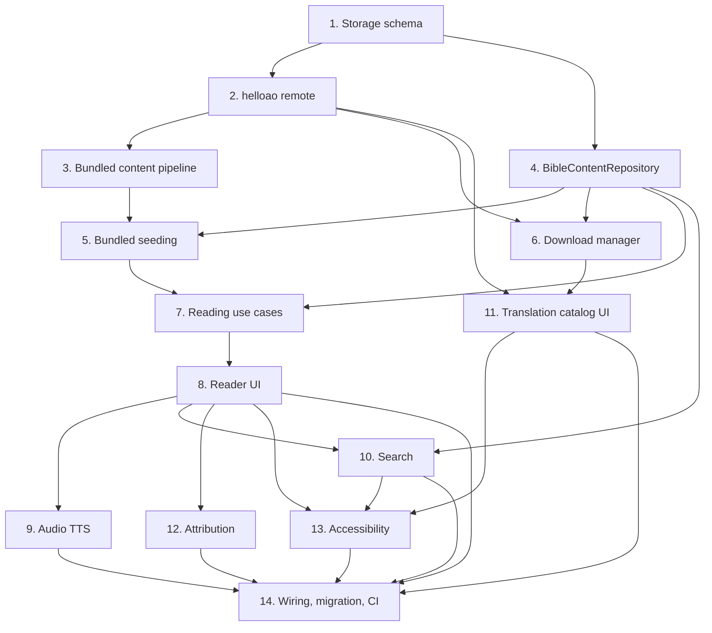

# Implementation Plan

- [ ] 1. Content storage schema (Room)
- [x] 1.1 Add Book/Chapter/Verse entities and FTS
  - Create `BookEntity`, `ChapterEntity`, `VerseEntity`, `VerseFtsEntity` (FTS4) in `data/local` with composite keys and indices per design.
  - _Requirements: 15.1, 15.2_
- [x] 1.2 Extend TranslationEntity and add BibleContentDao
  - Add `isBundled`, `contentVersion`, `verseCount` to `TranslationEntity`. Create `BibleContentDao` (observeBooks, getChapter, getChapterMeta, getBook, transactional inserts, deleteTranslationContent, FTS search).
  - _Requirements: 2, 5, 10, 15.1, 15.3_
- [x] 1.3 Register entities in MannaDatabase with migration
  - Bump DB version; add new entities + DAO accessor; provide a migration that preserves annotations/preferences (additive).
  - _Requirements: 15.4, 15.5_
- [ ]* 1.4 Room DAO tests (in-memory)
  - Insert/fetch chapter, delete-translation isolation, FTS match + canon restriction.
  - _Requirements: 2, 5, 10, 15_

- [ ] 2. Free Use Bible API remote
- [x] 2.1 Add HelloAo DTOs and Retrofit API
  - `AvailableTranslationsDto`, `BooksDto`, `ChapterDto` (kotlinx.serialization). `HelloAoApi` with the three endpoints; base URL `https://bible.helloao.org/api/`.
  - _Requirements: 4.1, 5.1_
- [x] 2.2 Implement HelloAoRemoteDataSource (replace stub)
  - Implement existing `TranslationRemoteDataSource`: `fetchCatalog()` maps DTO → domain `Translation` (derive canonType/hasDeuterocanon from book set); `downloadTranslation(id)` streams books+chapters. Map verse content segments → plain text; preserve canonical numbering.
  - _Requirements: 4.1, 4.2, 5.1_
- [ ]* 2.3 Mapping unit tests with fixture JSON
  - DTO→domain mapping, plain-text flattening, canon inference. No network.
  - _Requirements: 4.2, 5.1_

- [ ] 3. Bundled content pipeline
- [ ] 3.1 Add :app:prepareBundledBibles Gradle task
  - Gradle task that downloads WEB + WEB-deuterocanon from helloao, normalizes verses, writes gzipped `assets/bibles/web.bible.json`, `web_deuterocanon.bible.json`, and `manifest.json`. Idempotent on `bundledContentVersion`. Document CI usage (run before assemble).
  - _Requirements: 1.1, 1.6, 12.2_
- [ ] 3.2 Define bundled asset schema + parser
  - Serializable models for the bundled `*.bible.json` + `manifest.json`; a parser in `data` that streams entries for seeding.
  - _Requirements: 1.1, 15.2_

- [ ] 4. BibleContentRepository
- [ ] 4.1 Implement BibleContentRepository over BibleContentDao
  - `books`, `chapter` (→ `ChapterContent`), `hasContent`, `search` (→ `VerseMatch`). Pure delegation; no canon logic.
  - _Requirements: 2.1, 2.5, 10.1, 13.1_
- [ ]* 4.2 Repository tests (in-memory Room)
  - chapter fetch, hasContent, search correctness/perf shape.
  - _Requirements: 2, 10, 13_

- [ ] 5. Bundled seeding
- [ ] 5.1 Implement BundledBibleSeeder
  - Parse assets, insert via BibleContentDao transactionally, register `TranslationEntity(isBundled, contentVersion)`. Idempotent + resumable; off main thread.
  - _Requirements: 1.1, 1.2, 1.3, 1.5, 13.4, 15.2_
- [ ] 5.2 Startup wiring for seeding
  - Trigger seeding on app start (bootstrap use case / WorkManager one-shot); reader waits only when no content exists.
  - _Requirements: 1.1, 1.6_
- [ ]* 5.3 Seeder tests
  - Idempotence (no duplicates over repeated seeds); resume after partial.
  - _Requirements: 1.3, 1.5, 15.2_

- [ ] 6. Download manager
- [ ] 6.1 Implement DownloadManager
  - online: fetch books+chapters, insert transactionally, mark downloaded + contentVersion at end, emit progress. offline: enqueue via PendingDownloadRepository. cancel/failure: delete partial + not marked. delete: remove content + clear marker + fallback active translation if needed. Storage size where available.
  - _Requirements: 5.1, 5.2, 5.3, 5.4, 5.5, 5.6, 5.7, 5.8, 11.5_
- [ ]* 6.2 DownloadManager tests
  - success commit+mark; cancel/failure deletes partial + unmarked; offline enqueues; delete fallback.
  - _Requirements: 5, 11, 15.4_

- [ ] 7. Reading use cases
- [ ] 7.1 Implement reading/navigation/active-translation/position use cases
  - `GetChapterUseCase`, `NavigateChapterUseCase` (canon-aware via CanonBookOrdering), `SetActiveTranslationUseCase` (persist), `RestoreReadingPositionUseCase` (lastReadPosition → nearest valid).
  - _Requirements: 2, 3, 6, 7_
- [ ]* 7.2 Use case tests
  - next/prev boundaries, picker membership, active switch nearest-position, restore fallbacks.
  - _Requirements: 3, 6, 7_

- [ ] 8. Reader UI
- [ ] 8.1 Implement ReaderViewModel
  - `ReaderUiState` (book, displayed chapter number via PsalmDisplay, verses + annotation flags, audio state, loading/error). Persist reading position on view. Compose with CanonEngine/CanonBookOrdering.
  - _Requirements: 2, 3, 7, 8, 13.3_
- [ ] 8.2 Build ReaderScreen
  - Render verses; book+chapter picker (canon-ordered); prev/next; translation switcher entry; missing-content state with download/switch.
  - _Requirements: 2, 3, 6, 11.1_
- [ ] 8.3 Verse annotation in reader
  - Verse tap → highlight/bookmark/note via AnnotationRepository (canonical refs); show indicators; edit/delete.
  - _Requirements: 8.1, 8.2, 8.3, 8.4, 8.6_
- [ ] 8.4 Replace MainScreen with ReaderScreen in app nav
  - Route the post-setup destination to ReaderScreen, opening at restored position.
  - _Requirements: 2, 7_

- [x] 9. Audio (offline TTS)
- [x] 9.1 Define TtsReader + NarratedAudioProvider; implement AndroidTtsReader
  - Android TextToSpeech wrapper (`AndroidSpeechEngine`) behind a `SpeechEngine` seam; per-verse utterance ids → current verse index; play/pause/stop/speed(0.5–2.0); language voice resolution + graceful fallback; continuous-play at natural chapter end only. Verse-advance logic lives in pure-Kotlin `DefaultTtsReader`.
  - _Requirements: 9.1–9.8_
- [x] 9.2 Audio bar in ReaderScreen
  - Controls (play/pause/stop, speed, continuous-play) + current-verse highlight and auto-scroll wired to TtsReader state.
  - _Requirements: 9.2, 9.3, 9.4_
- [x]* 9.3 TTS verse-advance tests
  - Advance logic behind a faked TextToSpeech wrapper; fallback path (`DefaultTtsReaderTest`).
  - _Requirements: 9.2, 9.6_

- [ ] 10. Search
- [ ] 10.1 Implement SearchScriptureUseCase + SearchScreen/VM
  - FTS-backed search restricted to canon books; results with displayed reference + snippet; jump to verse on explicit selection; no-results state.
  - _Requirements: 10.1–10.6, 13.2_
- [ ]* 10.2 Search tests
  - match soundness, canon restriction, no-results.
  - _Requirements: 10_

- [ ] 11. Translation catalog UI
- [ ] 11.1 Implement TranslationCatalogScreen/VM
  - Immediately show bundled+downloaded; load remote when online via HelloAoRemoteDataSource; filter via TranslationFilter; download/cancel/delete with progress; switch active; offline + failure states with retry.
  - _Requirements: 4.3, 4.4, 4.5, 4.6, 5, 6, 11.2_

- [x] 12. Attribution / about
- [x] 12.1 Attribution surface
  - Per-translation `Attribution_Notice` (WEB public-domain) accessible from the reader's overflow menu; always-present Free Use Bible API (MIT) acknowledgement. Pure-domain `AttributionProvider` derives the notice; `AttributionScreen`/`AttributionViewModel` render it.
  - _Requirements: 12.1, 12.2, 12.3, 12.4_

- [x] 13. Accessibility pass
- [x] 13.1 Reader/search/catalog accessibility
  - Scalable `sp` text (responds to system font scale), content descriptions, and 48dp targets are in place across reader/search/catalog/attribution. Added RTL layout by script direction (`ScriptDirection` + `LocalLayoutDirection` in the reader, Req 14.4) and a Simplified Mode hook (preference + enlarged reader text, Req 14.5).
  - _Requirements: 14.1–14.5_

- [ ] 14. Wiring, migration, and CI
- [ ] 14.1 Hilt bindings + replace stub remote
  - Bind BibleContentRepository, BibleContentDao provider, HelloAoApi/Retrofit, HelloAoRemoteDataSource (replacing StubTranslationRemoteDataSource), DownloadManager, BundledBibleSeeder, TtsReader→AndroidTtsReader.
  - _Requirements: all_
- [ ] 14.2 CI: bundled-content prep + tests
  - Ensure `:app:prepareBundledBibles` (or committed assets) precede assemble in GitHub Actions; unit tests use fixtures (no network); confirm migration runs.
  - _Requirements: 1, 13, 15_
- [ ]* 14.3 Property-based tests
  - numbering stability, seeding idempotence, download integrity, search soundness.
  - _Requirements: 8.7, 15.2, 5.7, 10_

## Task Dependency Graph

